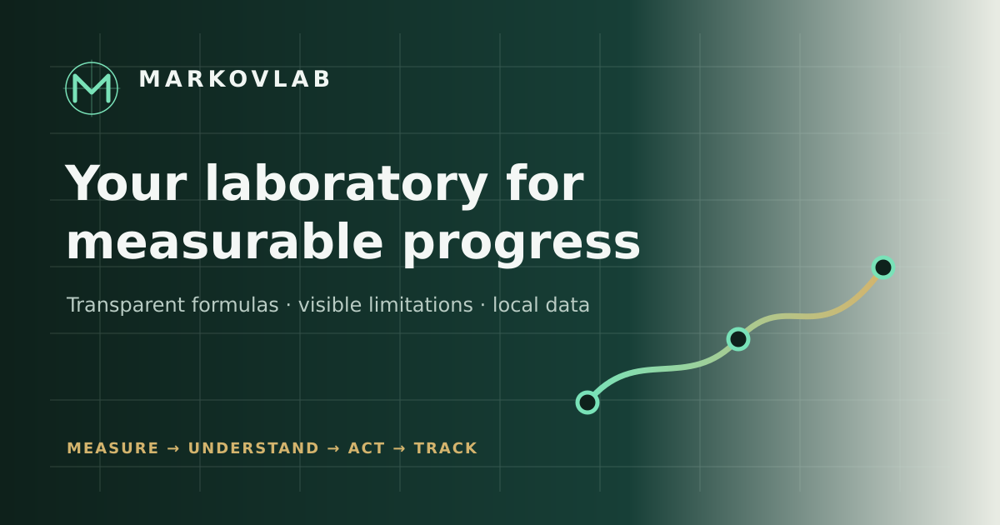

# MARKOVLAB 3.0

MARKOVLAB is a private, offline-first personal laboratory for measurable progress. It connects optional profile data to **85 transparent calculators across 9 domains**, explains method and evidence separately, shows uncertainty and limitations, and lets the user explicitly save results and profile snapshots.

> **Profile → input → calculation → meaning → evidence → limitation → action → history → trend.**



No account, backend, analytics, tracker, remote runtime dependency, opaque AI score or diagnostic claim is present.

## 3.0 product finish

- Flagship editorial Home with product loop, trust model, nine laboratories, curated tools, profile, insights, progress, evidence, privacy and FAQ.
- Nine visually distinct laboratory pages with original imagery, domain-specific boundaries and hand-curated workflows.
- Individual bilingual use-case copy for every calculator, semantic input help, method-specific confidence language, honest visualization policy, worked examples and related paths.
- Premium result hierarchy with locale-aware numbers, context, evidence, uncertainty, limitation, next action, formula, source relevance, copy/save/print actions and no arbitrary gauge.
- Optional six-section profile, persistent history/reopen, snapshots, unsmoothed accessible SVG trends, favorites and token-aware RU/EN search.
- Light, Dark, Midnight and System themes; responsive mobile/tablet/desktop compositions; keyboard command palette; reduced motion; print styling.
- Local-first state schema v2 with v1 migration, session drafts, bounded sanitized import/export, versioned PWA cache, offline navigation and explicit updates.
- Original M/orbit identity, unified SVG icons, RU/EN 1200×630 social assets and a coherent 16-image scientific-editorial WebP system.

## Run

Production needs no build step:

```bash
python3 -m http.server 8080
```

Open `http://localhost:8080/`. `file://` is unsupported because browsers restrict ES modules and service workers.

Development preview:

```bash
npm run dev -- --host 127.0.0.1 --port 4173
```

## Tests

```bash
npm test
```

Release gate: **44 tests, 0 failures**. Coverage includes formula vectors, 85 registry records, individualized content, 9 curated workflows, RU/EN renderers, accessibility invariants, deterministic recommendations, v1→v2 migration, import hardening, history/trends, PWA assets/lifecycle and absence of remote runtime JS/CSS.

## Architecture

- `assets/js/formulas.js` — pure tested formulas.
- `assets/js/calculators.js` — stable bilingual calculator registry and result models.
- `assets/js/content.js` — individual use cases, workflows, field help and visualization policy.
- `assets/js/references.js` — centralized evidence registry.
- `assets/js/storage.js`, `validators.js` — schema v2, migration and import trust boundary.
- `assets/js/recommendations.js` — transparent deterministic rules.
- `assets/js/renderers.js`, `renderers-v3.js` — semantic base renderer and 3.0 product layer.
- `assets/css/styles.css`, `styles-v3.css` — component foundation and final art direction.
- `assets/js/app.js` — events, drafts, persistence, import/export and PWA lifecycle.
- `assets/js/config.js` — the single release input for a future production URL.
- `tests/visual-harness.html` — bounded responsive viewport QA harness.

## Deployment

The folder is deployable to GitHub Pages root or repository subpath. All runtime paths are relative, routes are hash-based, and `.nojekyll`/`404.html` are included. When the public URL is known, set `productionBaseUrl` once in `assets/js/config.js`; do not invent it earlier. See `docs/DEPLOY.md`.

## Scientific boundary

Method type and evidence strength are independent axes. Strong evidence for an equation does not imply precise individual prediction. Biological estimates are rounded to method-level precision. MARKOVLAB is not a diagnostic or clinical dosing system. Formula code was not changed in 3.0; the existing regression suite and documented registry remain authoritative. See `docs/EVIDENCE.md` and `docs/FORMULAS.md`.

See `docs/QA_REPORT.md`, `docs/DESIGN_UX.md` and `docs/VISUAL_ASSETS.md` for the release record.

License: MIT.
